# Linux Server Monitoring with Prometheus & Grafana

A hands-on DevOps lab that implements a complete monitoring and alerting solution for a Linux server — from metric collection with **Prometheus** and **Node Exporter**, to visualization and alerting with **Grafana**.

Part of my `#AWSDevOpsRestartJourney` — rebuilding and documenting real-world DevOps skills, one project at a time.

---

## Overview

This project simulates a common real-world DevOps responsibility: keeping visibility into server health. It covers the full monitoring lifecycle — collecting system metrics, visualizing them on dashboards, and triggering alerts when thresholds are breached.

**What this lab demonstrates:**
- Installing and configuring Prometheus as a metrics collection and storage system
- Exposing Linux system metrics using Node Exporter
- Building Grafana dashboards for CPU, memory, disk, and network monitoring
- Writing PromQL queries to extract meaningful metrics
- Configuring threshold-based alert rules and notifications
- End-to-end testing of the alerting pipeline

---

## Tech Stack

| Tool | Purpose |
|---|---|
| **Linux (Ubuntu)** | Host server being monitored |
| **Prometheus** | Metrics collection & time-series storage |
| **Node Exporter** | Exposes host-level metrics (CPU, memory, disk, network) |
| **Grafana** | Dashboards & alert notifications |
| **PromQL** | Query language for Prometheus metrics |

---

## Architecture


**Flow:** Node Exporter collects host metrics → Prometheus scrapes and stores them → Grafana queries Prometheus (via PromQL) to render dashboards and evaluate alert rules → notifications fire when thresholds are crossed.

> **Note:** This lab runs Prometheus and Grafana on the same server for simplicity. In production, they're commonly split across separate servers — e.g. multiple Prometheus instances feeding one central Grafana — for better resource isolation and scaling. Grafana just needs network access to Prometheus's port `9090`; nothing else changes.
---

## Prerequisites

Before starting, make sure you have:

- A Linux server (Ubuntu 20.04/22.04 recommended) with `sudo` access — a local VM, EC2 instance, or any cloud VM works
- At least **1 vCPU / 1 GB RAM** free (2 GB+ recommended so Prometheus, Node Exporter, and Grafana can run comfortably together)
- **Internet access** on the server to download the Prometheus, Node Exporter, and Grafana packages
- Basic familiarity with the Linux command line (`sudo`, `systemctl`, editing files with `nano`/`vim`)
- The following ports open in your firewall / security group:

  | Port | Used by |
  |---|---|
  | `9090` | Prometheus UI |
  | `9100` | Node Exporter metrics endpoint |
  | `3000` | Grafana UI |

- `wget`, `tar`, and `curl` installed (usually available by default; install with `sudo apt-get install -y wget tar curl` if missing)
- An email address or Slack webhook to use as the alert notification destination (needed for Step 9)

---

## Steps Performed

### 1. Install & Configure Prometheus

- Downloaded and installed Prometheus on the Linux server:

  ```bash
  # Create a dedicated user for Prometheus
  sudo useradd --no-create-home --shell /bin/false prometheus

  # Download and extract the latest Prometheus release
  wget https://github.com/prometheus/prometheus/releases/download/v2.53.0/prometheus-2.53.0.linux-amd64.tar.gz
  tar -xvf prometheus-2.53.0.linux-amd64.tar.gz
  cd prometheus-2.53.0.linux-amd64

  # Move binaries and config to standard locations
  sudo mv prometheus promtool /usr/local/bin/
  sudo mkdir -p /etc/prometheus /var/lib/prometheus
  sudo mv prometheus.yml /etc/prometheus/
  sudo mv consoles/ console_libraries/ /etc/prometheus/

  # Set ownership
  sudo chown -R prometheus:prometheus /etc/prometheus /var/lib/prometheus
  ```

- The default `prometheus.yml` (moved into place above) already includes a scrape job for Prometheus itself, which is enough to start the service. The **Node Exporter scrape job** is added later, in **Step 3**, once Node Exporter is installed.

- Started Prometheus as a systemd service for reliability. Create the service file below now — this is separate from `prometheus.yml`: the service file tells systemd *how to run* Prometheus, while `prometheus.yml` tells Prometheus *what to scrape*:

  ```ini
  # /etc/systemd/system/prometheus.service
  [Unit]
  Description=Prometheus
  Wants=network-online.target
  After=network-online.target

  [Service]
  User=prometheus
  ExecStart=/usr/local/bin/prometheus \
    --config.file=/etc/prometheus/prometheus.yml \
    --storage.tsdb.path=/var/lib/prometheus/

  [Install]
  WantedBy=multi-user.target
  ```

  ```bash
  sudo systemctl daemon-reload
  sudo systemctl enable prometheus
  sudo systemctl start prometheus
  sudo systemctl status prometheus
  ```

- Verified the Prometheus UI on port `9090` by opening `http://<server-ip>:9090` in a browser.

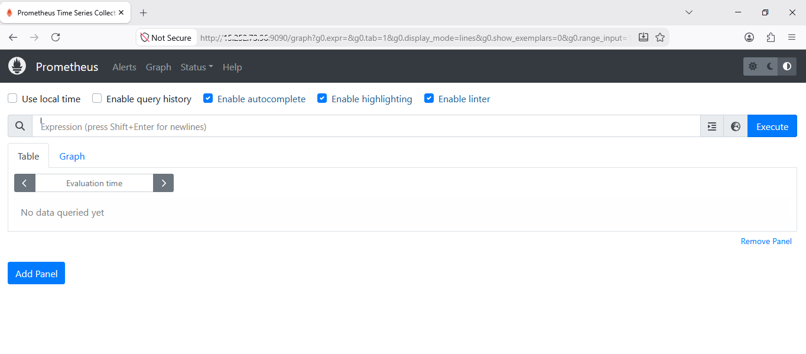

### 2. Install & Configure Node Exporter

- Installed Node Exporter to expose OS-level metrics (CPU, memory, disk, network):

  ```bash
  # Create a dedicated user for Node Exporter
  sudo useradd --no-create-home --shell /bin/false node_exporter

  # Download and extract the latest release
  wget https://github.com/prometheus/node_exporter/releases/download/v1.8.1/node_exporter-1.8.1.linux-amd64.tar.gz
  tar -xvf node_exporter-1.8.1.linux-amd64.tar.gz

  # Move the binary to a standard location
  sudo mv node_exporter-1.8.1.linux-amd64/node_exporter /usr/local/bin/
  sudo chown node_exporter:node_exporter /usr/local/bin/node_exporter
  ```

- Ran Node Exporter as a systemd service on port `9100`:

  ```ini
  # /etc/systemd/system/node_exporter.service
  [Unit]
  Description=Node Exporter
  Wants=network-online.target
  After=network-online.target

  [Service]
  User=node_exporter
  ExecStart=/usr/local/bin/node_exporter

  [Install]
  WantedBy=multi-user.target
  ```

  ```bash
  sudo systemctl daemon-reload
  sudo systemctl enable node_exporter
  sudo systemctl start node_exporter
  sudo systemctl status node_exporter
  ```

- Verified that metrics were being exposed:

  ```bash
  curl http://public-ip:9100/metrics | head -20
  ```

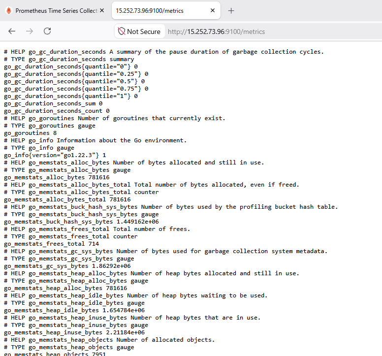

### 3. Configure Prometheus to Scrape Node Exporter

- Added a scrape job for `node_exporter` in `prometheus.yml`:

  ```yaml
  # /etc/prometheus/prometheus.yml
  global:
    scrape_interval: 15s
    evaluation_interval: 15s

  scrape_configs:
    - job_name: 'prometheus'
      static_configs:
        - targets: ['localhost:9090']

    - job_name: 'node_exporter'
      static_configs:
        - targets: ['localhost:9100']
  ```

- Validated the config file and reloaded Prometheus:

  ```bash
  promtool check config /etc/prometheus/prometheus.yml
  sudo systemctl restart prometheus
  ```

- Confirmed the target shows as **UP** under `Status → Targets` in the Prometheus UI (`http://<server-ip>:9090/targets`).

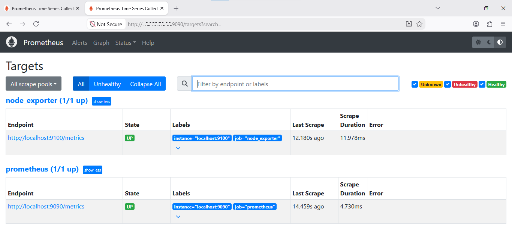

### 4. Install & Configure Grafana

- Installed Grafana on the same server using the official Ubuntu/Debian APT repository:

  ```bash
  sudo apt-get install -y apt-transport-https software-properties-common wget

  # Add Grafana's GPG key and APT repository
  sudo mkdir -p /etc/apt/keyrings/
  wget -q -O - https://apt.grafana.com/gpg.key | sudo gpg --dearmor -o /etc/apt/keyrings/grafana.gpg
  echo "deb [signed-by=/etc/apt/keyrings/grafana.gpg] https://apt.grafana.com stable main" | sudo tee /etc/apt/sources.list.d/grafana.list

  sudo apt-get update
  sudo apt-get install -y grafana
  ```

- Started and enabled the Grafana service:

  ```bash
  sudo systemctl daemon-reload
  sudo systemctl enable grafana-server
  sudo systemctl start grafana-server
  sudo systemctl status grafana-server
  ```

- Logged into the Grafana UI on port `3000`:
  - Open `http://<server-ip>:3000`
  - Default credentials: `admin` / `admin` (you'll be prompted to change the password on first login)

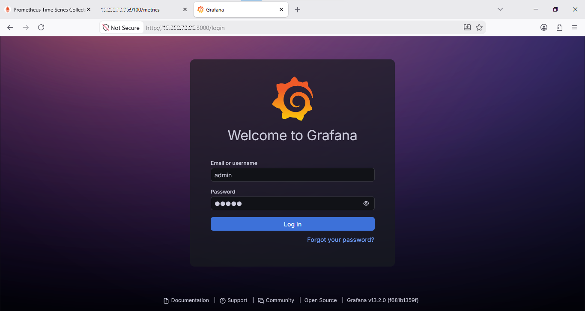

- After loggedin

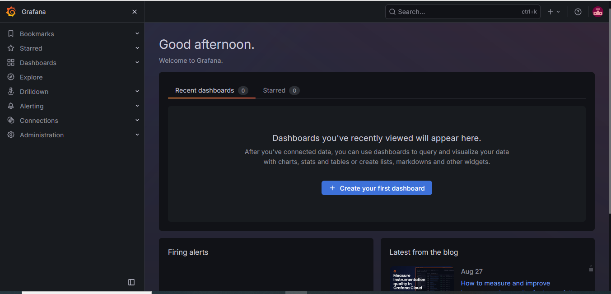

### 5. Add Prometheus as a Data Source

- Connected Grafana to Prometheus:
  1. In Grafana, go to **Connections → Data sources → Add data source**.
  2. Select **Prometheus**.
  3. Set the URL to `http://localhost:9090`.
  4. Leave the authentication settings as default (no auth is needed for a local setup).
  5. Click **Save & Test**.

- Verified that the connection was successful — Grafana shows a green **"Successfully queried the Prometheus API"** message.

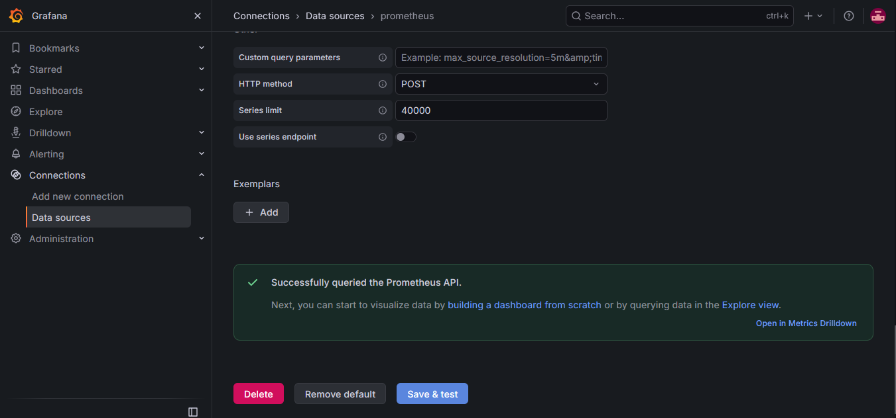

### 6. Build the Monitoring Dashboard

Created a Grafana dashboard with panels for CPU, memory, disk, and network:

1. Go to **Dashboards → New → New Dashboard **.
2. Click **Add Panel and Add visualization** and select the **Prometheus** data source.
3. For each panel:
   - Paste the relevant PromQL query (see Step 7).
   - Set the panel title (e.g. "CPU Utilization").
   - Choose a visualization type — **Time series** works well for CPU/Memory/Network, and **Gauge** works well for Disk.
   - Set the unit to **Percent (0–100)** for the CPU/Memory/Disk panels.
     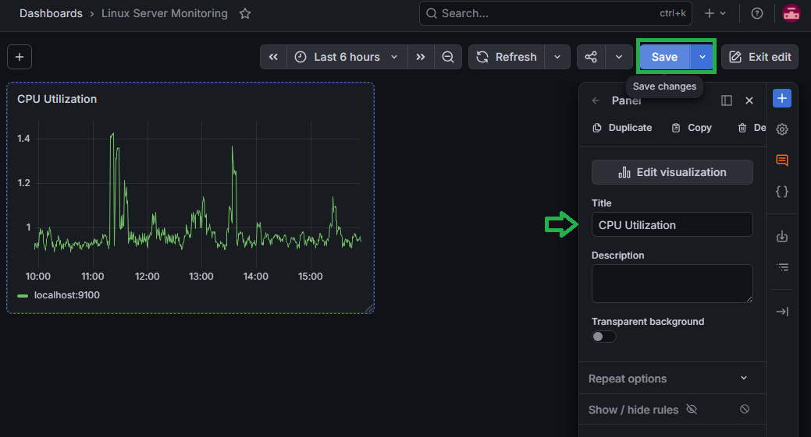

4. Repeat for all four panels:
   - **CPU Utilization**
   - **Memory Utilization**
   - **Disk Utilization**
   - **Network Traffic**
5. Click **Save dashboard**, give it a name (e.g. "Linux Server Monitoring"), and save.
   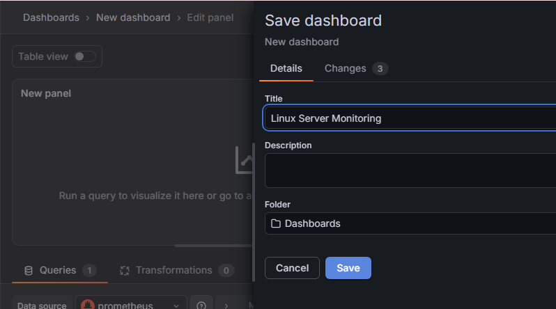

Grafana dashboard with CPU, Memory, Disk and Network panels

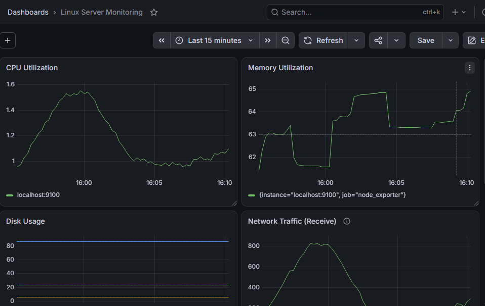

### 7. PromQL Queries Used

Each query below was entered directly into the panel's query editor (Step 6 → panel → Query tab):

| Metric | PromQL Query |
|---|---|
| CPU Usage | `100 - (avg by(instance) (rate(node_cpu_seconds_total{mode="idle"}[5m])) * 100)` |
| Memory Usage | `(1 - (node_memory_MemAvailable_bytes / node_memory_MemTotal_bytes)) * 100` |
| Disk Usage | `100 - ((node_filesystem_avail_bytes{fstype!~"tmpfs|overlay"} / node_filesystem_size_bytes{fstype!~"tmpfs|overlay"}) * 100)` |
| Network Traffic (Receive) | `rate(node_network_receive_bytes_total{device!="lo"}[5m])` |
| Network Traffic (Transmit) | `rate(node_network_transmit_bytes_total{device!="lo"}[5m])` |

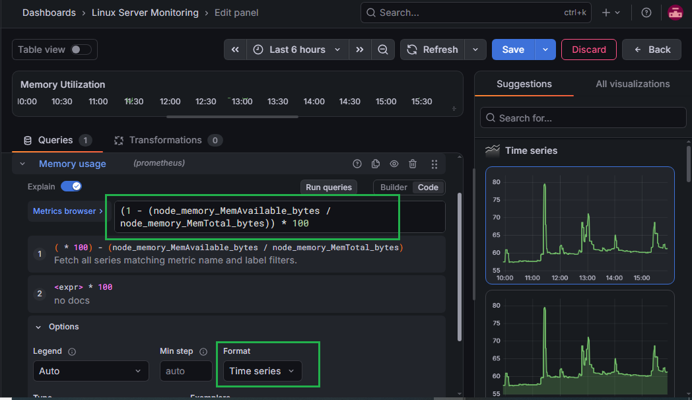

### 8. Configure Alert Notifications

Create the contact point first, since the alert rule wizard needs one to exist before you can select it:
 
1. Go to **Alerting → Notification configuration**.
2. Open the **Contact points** tab and click **Create contact point**.
3. Enter a **Name** (e.g. `Sinsha`) and set **Integration** to **Email**.
4. Under **Addresses**, enter the recipient email address (e.g. `mailtosinsha@gmail.com`) — multiple addresses can be separated with `;`, `,`, or a newline.
5. Optionally enable **Single email** under Optional Email settings to send one email to all recipients instead of one per recipient.
6. Click **Save**.

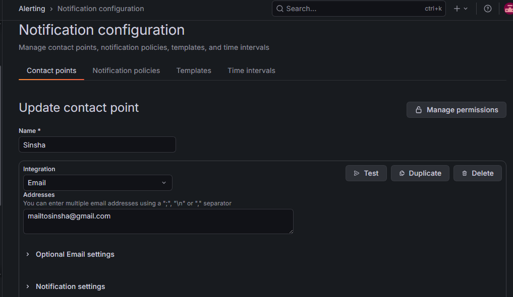

7. Edit the configuration and test mail will say "Test notification failed
SMTP not configured, check your grafana.ini config file's [smtp] section"

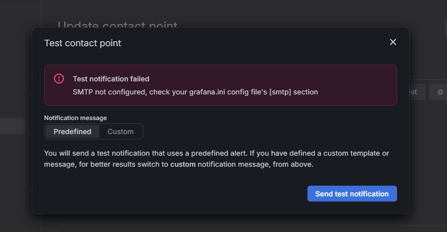 
 
> Before creating the contact point, configure SMTP so Grafana can actually send emails — the contact point alone doesn't send mail without it:
 
1. Generate an app password for your Gmail account. Google blocks sign-ins from apps like Grafana that use a plain username/password over SMTP. Go straight to **[myaccount.google.com/apppasswords](https://myaccount.google.com/apppasswords)** (or search "App passwords" in the Google Account search bar), name it (e.g. "Grafana"), and click **Create**. 2-Step Verification must already be turned on for this page to be accessible.
2. Open `/etc/grafana/grafana.ini` and find (or add) the `[smtp]` section:
```ini
   [smtp]
   enabled = true
   host = smtp.gmail.com:587
   user = your-email@gmail.com
   password = your-16-character-app-password
   from_address = your-email@gmail.com
   from_name = Grafana
   skip_verify = false
```
3. Restart Grafana to apply the change:
```bash
   sudo systemctl restart grafana-server
```
4. Test mail works now. 

### 9. Configure Alert Rules
 
Set up alert rules in Grafana for critical thresholds, using **Alerting → Alert rules → New alert rule**:
 
1. **Enter alert rule name** — e.g. `High CPU Usage`.
2. **Define query and alert condition:**
   - Paste the relevant PromQL query into the query editor (e.g. `100 - (avg by(instance) (rate(node_cpu_seconds_total{mode="idle"}[5m])) * 100)`).
   - Leave the time range at the default (`10m` to now) — it only affects the preview, not the alert itself.
   - Under **Alert condition**, set **WHEN QUERY** → **Is above** → `80`.
   - Click **Preview alert rule condition** to confirm it evaluates as expected before saving.
   
   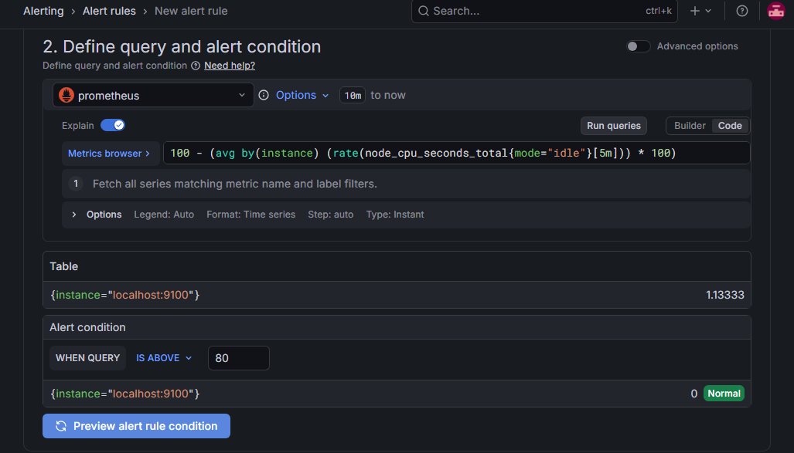

3. **Add folder and labels:**
   - Folder: create or select one (e.g. `Server Monitoring`).
   - Labels: optional — add labels like `severity=critical` if you want to route alerts by label later.
4. **Set evaluation behavior:**
   - Evaluation group and interval: create a new evaluation group (e.g. `server-monitoring`) and set it to evaluate every `1m`.
   - Pending period: `5m` — the condition must hold for 5 minutes before the alert fires.
   - Keep firing for: `None` — the alert returns to Normal as soon as the condition clears.

   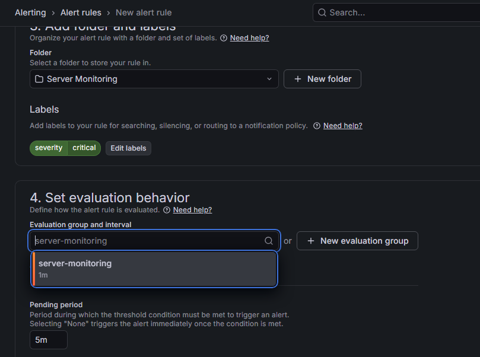

5. **Configure notifications:**
   - Recipient → Contact point: select the `email-alerts` contact point created in Step 8.
6. **Configure notification message:**
   - Summary: e.g. `CPU usage is above 80% for more than 5 minutes`.
   - Description and Runbook URL are optional.
7. Click **Save**.

   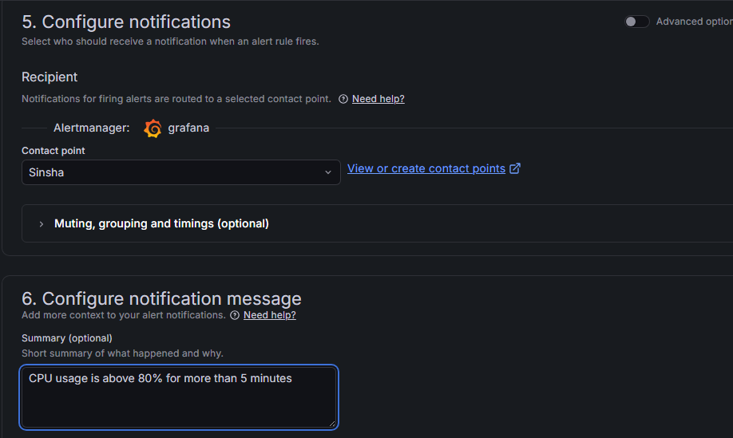

Repeat the same flow for the disk alert:
- Query: `100 - ((node_filesystem_avail_bytes{fstype!~"tmpfs|overlay"} / node_filesystem_size_bytes{fstype!~"tmpfs|overlay"}) * 100)`
- Condition: **Is above** `80`
- Pending period: `5m`
- Name: `High Disk Usage`
**Alert rules configured:**
- CPU usage above 80% for 5 minutes
- Disk usage above 80% for 5 minutes
> By default, selecting a contact point directly in the rule (Step 5 above) routes notifications for that rule automatically. If you later want different alerts routed to different contacts based on labels, you can additionally configure this under **Alerting → Notification policies**.
 
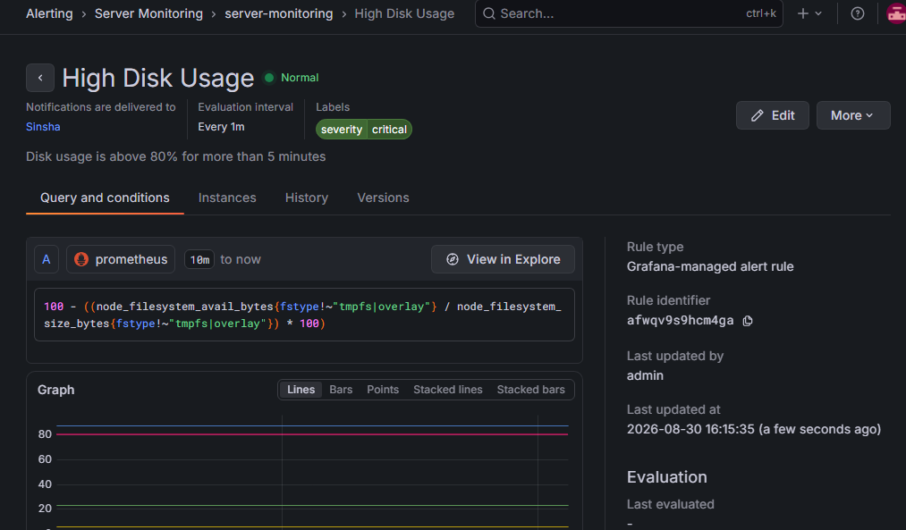

### 10. Test the Alerting Pipeline

- Generated artificial CPU load to cross the CPU threshold:

  ```bash
  sudo apt-get install -y stress
  stress --cpu 4 --timeout 360s   # keeps 4 CPU cores busy for 6 minutes
  ```

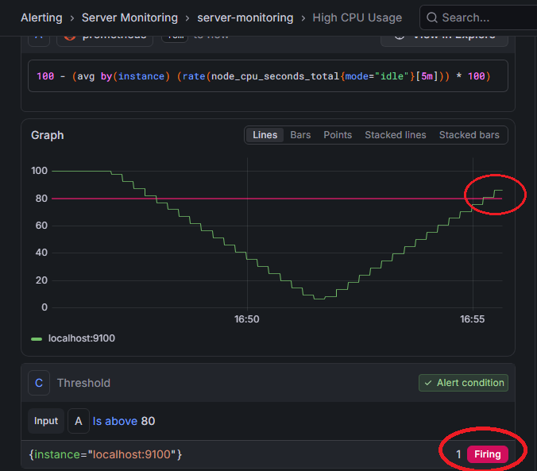
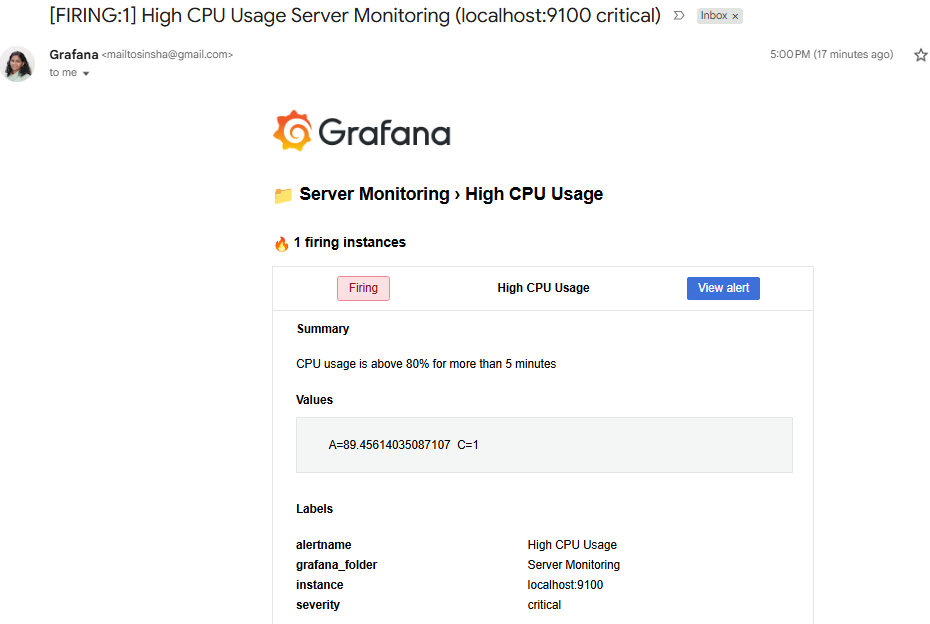

- Filled disk space temporarily to cross the disk threshold:

  ```bash
  fallocate -l 5G /tmp/fill_disk.img   # adjust the size based on available disk space

  # remove afterwards to free space:
  rm /tmp/fill_disk.img
  ```

- Watched the alert state transition in **Alerting → Alert rules**:
  - **Normal** → **Pending** (condition breached, waiting out the `for: 5m` duration) → **Firing** (notification sent)

- Confirmed that the notification was received successfully in the configured email inbox or Slack channel.

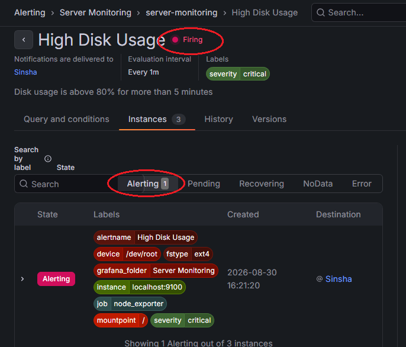
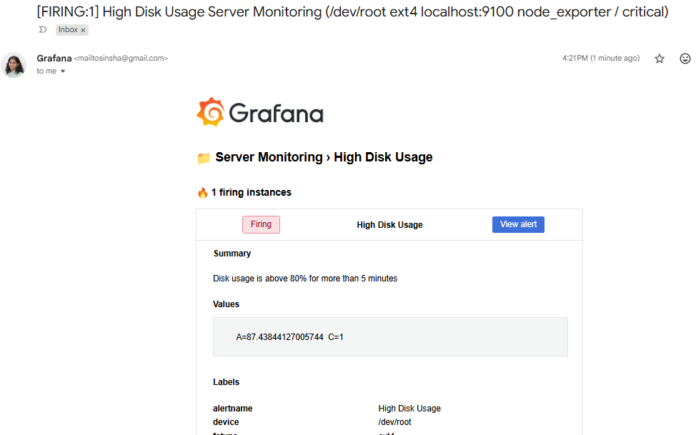

> Save each screenshot inside a `screenshots/` folder in the repo root using the filenames above (or update the paths in this file to match your own naming).

---

## Key Learnings

- How Prometheus's pull-based scraping model works alongside exporters like Node Exporter
- Writing PromQL from scratch to calculate percentages and rates from raw counter metrics
- The difference between a Prometheus alert rule and a Grafana-native alert rule
- How Grafana alert states move through **Normal → Pending → Firing** based on the `for` duration
- Practical debugging of "target down" issues (firewall/port access, service status, scrape config)

---

## Author

**Sinsha C**
 
## Connect

If you're on a similar DevOps learning journey, feel free to connect or follow along:

[](https://github.com/sinsha-c)
[](https://linkedin.com/in/sinshac)
